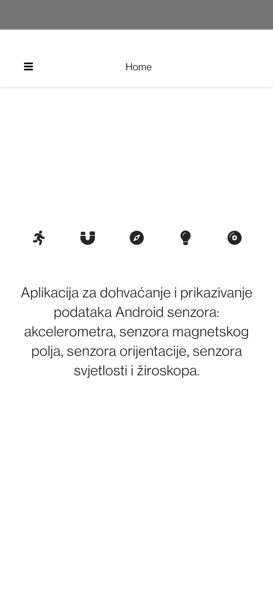
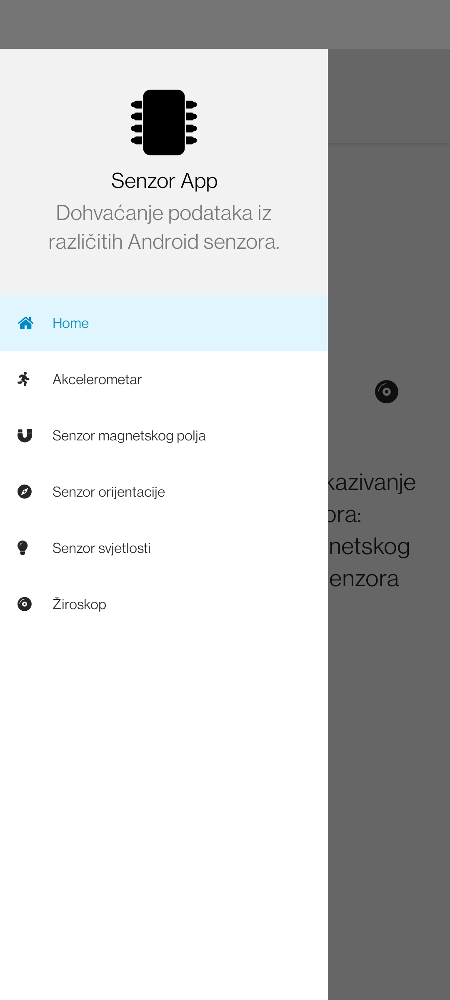
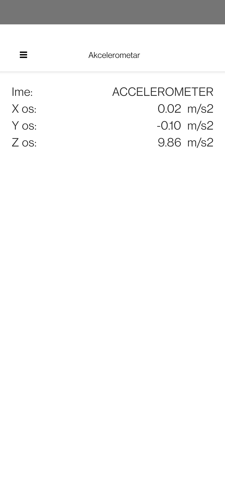
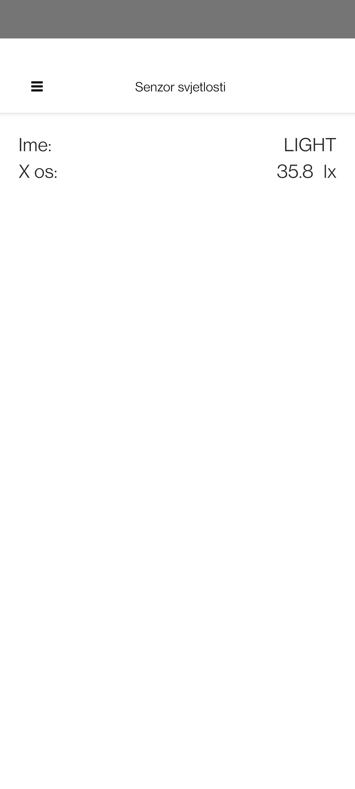
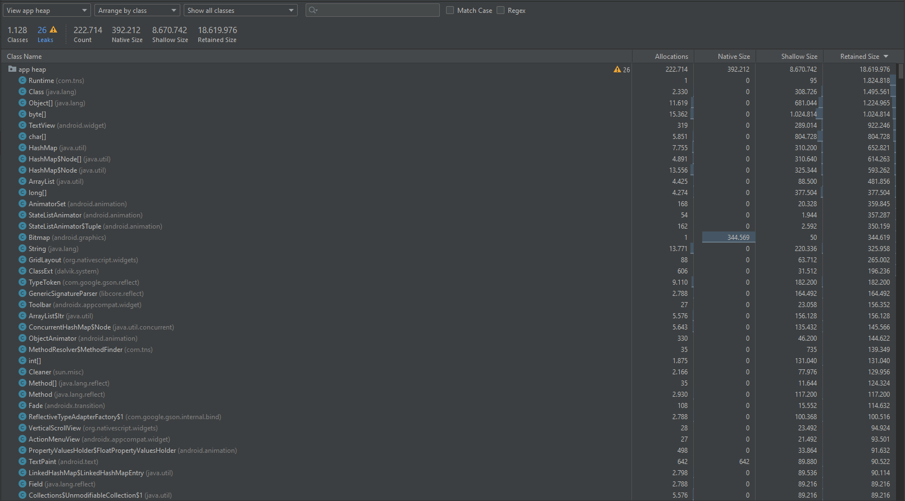
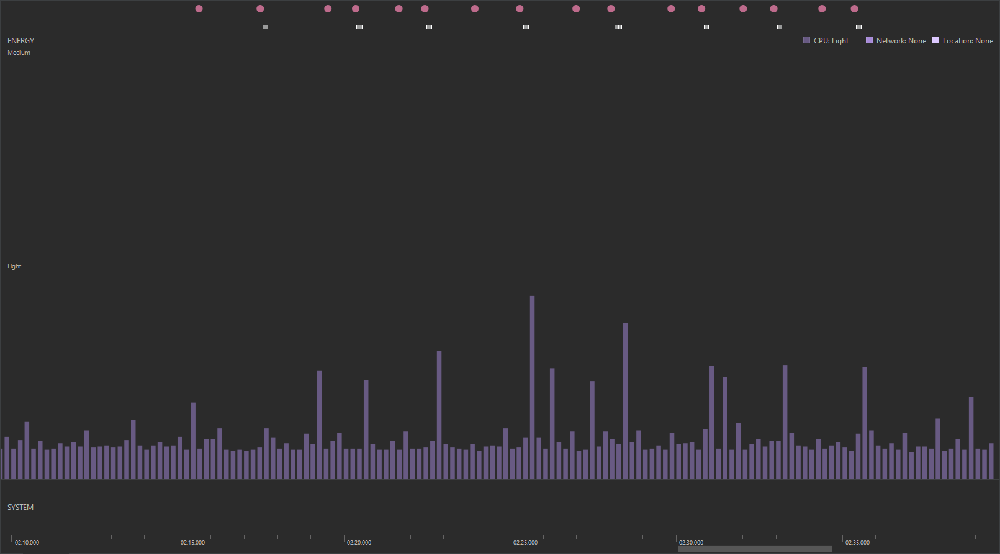

# NativeScript senzor aplikacija

U nastavku je razložen razvojni proces NativeScript Android aplikacije sa senzorima. Aplikacija se služi NativeScript pluginom koji dohvaća informacije o senzoru i vrijednosti koje senzor očitava za cijeli skup Android mobilnih senzora. Senzori koji se koriste u aplikaciji su:

- akcelerometar
- senzor magnetskih polja
- senzor orijentacije
- senzor svjetlosti
- žiroskop

Aplikacija je namijenjena jednostavnom očitavanju mjerenih vrijednosti i informacija o spomenutim senzorima. Sastavljena je od 6 aktivnosti, jedne Home aktivnosti i pet aktivnosti za Android senzore. Kako bi koristili senzore, potrebno je otvoriti "drawer" ili ladicu kroz koju je moguće navigirati na bilo koji od spomenutih senzora.

## 1. Postavljanje projekta

Prije svega, pametno je uvjeriti se da je NativeScript dobro postavljen prije početka rada na projektu:

``` console
$ ns doctor android
```

Kako bi krenuli s radom, potrebno je otvoriti novi udaljeni GitHub repozitorij na kojemu će se nalaziti izvorni kod projekta. Zatim u željeni lokalni direktorij kloniramo repozitorij naredbom:

``` console
$ git clone https://github.com/proto-forma/nativescript-sensor-app.git
```

Nakon kloniranja, pozicioniramo se u novostvoreni direktorij aplikacije:

``` console
$ cd nativescript-sensor-app/
```

Pokrećemo naredbu koja stvara novu NativeScript aplikaciju na temelju gotovog predloška:

``` console
$ tns create nativescript-sensor-app --template @nativescript/template-drawer-navigation
```

Ponovno se pozicioniramo u novostvoreni direktorij:

``` console
$ cd nativescript-sensor-app/
```

Sada možemo pokrenuti aplikaciju na našem Android uređaju kako bi se uvjerili da je postavljanje bilo uspješno:

``` console
$ ns run android
```

Ako sve radi, slijedi i inicijalno podizanje aplikacije na udaljeni repozitorij:

``` console
$ git remote add nativescript-sensor-app https://github.com/proto-forma/nativescript-sensor-app.git
$ git add -A
$ git commit -m "Inicijalno podizanje projekta."
$ git push nativescript-sensor-app main
```

## 2. Layout

Kada prvi puta pokrenemo aplikaciju, na nekim uređajima (uključujući mojem) možemo uočiti da aplikacija ne uzima u obzir gornji dio zaslona ukoliko ima usjek za prednju kameru. To možemo popraviti tako da se pozicioniramo u direktorij `/App_Resources/Android/src/main/res/values-v21` te u datoteci `styles.xml` izmjenimo slijedeći redak iz `true` u `false` u:

``` xml
<style name="AppThemeBase21" parent="AppThemeBase">
    ...

    <item name="android:windowTranslucentStatus">false</item>
    
    ...
</style>
```

Također je potrebno zakomentirati i slijedeći redak u istoj datoteci:

``` xml
<style name="NativeScriptToolbarStyle" parent="NativeScriptToolbarStyleBase">
    ...

    <!-- <item name="android:paddingTop">24dp</item> -->
    
    ...
</style>
```

Kako koristimo `template-drawer-navigation` layout, možemo izmjeniti što se sve i na koji način prikazuje u ladici. Prvo ćemo izmjeniti *header* koji trenutno prikazuje generičke podatke profila. Pozicioniramo se u direktorij `/app/app-root/` te u datoteci `app-root.xml` mijenjamo *header* na slijedeći način:

1. Ubacujemo [FontAwesome ikonu](https://fontawesome.com/icons/microchip?s=solid) koja simbolizira senzor

    - mičemo sve klase osim `fas t-36`
    - postavljamo postotnu širinu sličice

2. Sadržaj naslova mijenjamo u naziv aplikacije

    - postavljamo i gornju marginu kako tekst ne bi bio tik do sličice

3. Sadržaj podnaslova mijenjamo u kratki opis aplikacije

    - postavljamo gornju marginu kako tekst ne bi bio tik do naslova 
    - postavljamo `textWrap` na kako sadržaj ne bi izlazio van dimenzija komponente


``` xml
<StackLayout class="nt-drawer__header">
    <Image class="fas t-36" src="font://&#xf2db;" width="20%"/>
    <Label class="nt-drawer__header-brand m-t-10" text="Senzor App" />
    <Label class="nt-drawer__header-footnote m-t-5" textWrap="true" text="Dohvaćanje podataka iz različitih Android senzora." />
</StackLayout>
```

Također možemo izmjeniti i elemente ladice za sve aktivnosti koje ćemo imati u aplikaciji. Ostaviti ćemo `Home` "entry" netaknutim (sadržavati će opis aplikacije), a izmjeniti ćemo ostale na slijedeći način:

``` xml
<GridLayout
    columns="auto, *"
    class="{{ 'nt-drawer__list-item' + (selectedPage === 'Akcelerometar' ? ' -selected': '') }}"
    route="akcelerometar/akcelerometar-page"
    title="akcelerometar"
    tap="onNavigationItemTap"
>
    <Label row="0" col="0" text="&#xf70c;" class="nt-icon fas" />
    <Label row="0" col="1" text="Akcelerometar" class="p-r-20" />
</GridLayout>

<GridLayout
    columns="auto, *"
    class="{{ 'nt-drawer__list-item' + (selectedPage === 'Magnet' ? ' -selected': '') }}"
    route="magnet/magnet-page"
    title="Magnet"
    tap="onNavigationItemTap"
>
    <Label row="0" col="0" text="&#xf076;" class="nt-icon fas" />
    <Label row="0" col="1" text="Senzor magnetskog polja" class="p-r-20" />
</GridLayout>

<GridLayout
    columns="auto, *"
    class="{{ 'nt-drawer__list-item' + (selectedPage === 'Orijentacija' ? ' -selected': '') }}"
    route="orijentacija/orijentacija-page"
    title="Orijentacija"
    tap="onNavigationItemTap"
>
    <Label row="0" col="0" text="&#xf14e;" class="nt-icon fas" />
    <Label row="0" col="1" text="Senzor orijentacije" class="p-r-20" />
</GridLayout>

<GridLayout
    columns="auto, *"
    class="{{ 'nt-drawer__list-item' + (selectedPage === 'Svjetlost' ? ' -selected': '') }}"
    route="svjetlost/svjetlost-page"
    title="Svjetlost"
    tap="onNavigationItemTap"
>
    <Label row="0" col="0" text="&#xf0eb;" class="nt-icon fas" />
    <Label row="0" col="1" text="Senzor svjetlosti" class="p-r-20" />
</GridLayout>

<GridLayout
    columns="auto, *"
    class="{{ 'nt-drawer__list-item' + (selectedPage === 'Ziroskop' ? ' -selected': '') }}"
    route="ziroskop/ziroskop-page"
    title="Ziroskop"
    tap="onNavigationItemTap"
>
    <Label row="0" col="0" text="&#xf51f;" class="nt-icon fas" />
    <Label row="0" col="1" text="Žiroskop" class="p-r-20" />
</GridLayout>
```

Sada možemo izbrisati direktorije koji sadržavaju kod za aktivnosti koje su došle sa template-om. Potom kopiramo direktorij `Home` za onoliko aktivnosti koliko želimo imati u aplikaciji. U datotekama stvorenih direktorija potrebno je preimenovati nazive metoda, modula i ruta koristeći nazive aktivnosti koje smo u layoutu iznad definirali kako bi aplikacija bila pravilno pospajana sa novim aktivnostima.

## 3. Instalacija sensor plugina

Izrađujemo aplikaciju koja sadrži Android senzor. Kako bi dobivali podatke iz senzora potrebno je instalirati [plugin za korištenje Android senzora](https://market.nativescript.org/plugins/nativescript-android-sensors/):

``` shell
npm i --save nativescript-android-sensors
```

U slučaju da nakon instalacije dobijemo error:

> minSdkVersion *X* cannot be smaller than version *Y*

potrebno je pozicionirati se u direktorij `/App_Resources/Android` te u datoteci `app.gradle` izmjenimo `minSdkVersion` sa `17` na `21`:

``` gradle
android {
  defaultConfig {
    minSdkVersion 21

    ...
}
```

## 4. Prikazivanje podataka senzora

Sve aktivnosti senzora imaju sličnu logiku i layout. Na primjeru sadržaja datoteka za aktivnost "Akcelerometar" prikazati ćemo generalni način rada svih aktivnosti senzora.  

Krenimo sa layoutom i `.xml` datotekom. `<ActionBar>` komponentu ostavljamo istom. Jedino što mijenjamo za svaku aktivnost je tekst label-a koji predstavlja naslov headera aktivnosti.  

``` xml
<ActionBar>
    <NavigationButton visibility="hidden"></NavigationButton>
    <GridLayout columns="50, *">
        <Label class="action-bar-title" text="Akcelerometar" colSpan="2"/>
        <Label class="fas" text="&#xf0c9;" tap="onDrawerButtonTap"/>
    </GridLayout>
</ActionBar>
```

Nadalje, `<GridLayout>` komponentu možemo "okružiti" `<ScrollView>` komponentom u slučaju da neka aktivnost sadrži puno teksta koji bi se inače prelijevao preko donje granice prozora.

``` xml
<ScrollView orientation="vertical">
    <GridLayout ...>

        ...

    </GridLayout>
</ScrollView>
```

Određujemo i broj redaka i stupaca te njihove veličine. U ovome slučaju definiramo 4 redaka kojima dopuštamo `auto` "sizing", a 5 stupaca od kojih prvi i zadnji služe za udaljavanje sadržaja od bočnih strana prozora. Središnja 3 stupca sadrže podatke o komponentama senzora.

``` xml
<GridLayout marginTop="20" rows="auto, auto, auto, auto" columns="20,*,*,55,20">
    
    ...

</GridLayout>
```

Svaki skup dolje navedenih `<Label>` komponenata, osim skupa koji predstavlja ime senzora, sastoji se od tri labela:

1. Label za prikaz naziva mjerene komponente senzora
2. Label za prikaz vrijednosti mjerene komponente senzora u nekom trenutku
3. Label za prikaz mjerne jedinice komponente senzora

Što se formatiranja sadržaja tiče, tu su uobičajene mjere: 

- promjena veličine fonta
- postavljanje poravnjanja teksta
- transformacija prikaza teksta
- raspon elementa kroz više stupaca

``` xml
<GridLayout ...>
    <Label text="Ime:" fontSize="20" row="0" col="1" ></Label>
    <Label text="{{ ime }}" fontSize="20" textAlignment="right" textTransform="uppercase" row="0" col="2" colSpan="2"></Label>

    <Label text="X os:" fontSize="20" row="1" col="1"></Label>
    <Label text="{{ x }}" fontSize="20" textAlignment="right" row="1" col="2"></Label>
    <Label text="m/s2" fontSize="20" textAlignment="right" row="1" col="3" ></Label>

    <Label text="Y os:" fontSize="20" row="2" col="1"></Label>
    <Label text="{{ y }}" fontSize="20" textAlignment="right" row="2" col="2"></Label>
    <Label text="m/s2" fontSize="20" textAlignment="right" row="2" col="3" ></Label>

    <Label text="Z os:" fontSize="20" row="3" col="1"></Label>
    <Label text="{{ z }}" fontSize="20" textAlignment="right" row="3" col="2"></Label>
    <Label text="m/s2" fontSize="20" textAlignment="right" row="3" col="3" ></Label>
</GridLayout>
```

## 5. Dohvaćanje podataka senzora

Postavljanje logike dohvaćanja podataka senzora izvršavamo u `akcelerometar-view-model.js` datoteci.  

Prvo je potrebno napraviti unos potrebnih modula:

``` js
import { Observable } from '@nativescript/core'
import { SelectedPageService } from '../shared/selected-page-service'
import { AndroidSensors, AndroidSensorListener, SensorDelay } from 'nativescript-android-sensors';
```

Sada je potrebno stvoriti novu instancu objekta `Observable()` koji će sadržavati kontekst našeg ViewModela. Senzor akcelerometra [vraća tri vrijednosti](https://developer.android.com/reference/android/hardware/SensorEvent#values) - za x, y i z os:

``` js
export function AkcelerometarViewModel() {
    SelectedPageService.getInstance().updateSelectedPage('Akcelerometar')

    const viewModel = new Observable()
    viewModel.ime = 0
    viewModel.x = 0
    viewModel.y = 0
    viewModel.z = 0

    ...

    return viewModel
}
```

Sada kreiramo i instancu objekta `AndroidSensors()` koja će sadržavati sve senzore s kojima radimo. Međutim, u svakoj aktivnosti ove aplikacije radi se samo s jednim senzorom. Dodatno deklariramo i varijablu koja će sadržavati instancu željenog senzora.

``` js
...

var senzori = new AndroidSensors()
var akcelerometar

...
```

Zatim kreiramo i instancu slušatelja Android senzora koji vraća podatke kada se stanje senzora promjeni. Instanca se sastoji od dvije metode:

1. `onAccuracyChanged()` koja vraća informacije o senzoru i njegovu preciznost
2. `onSensorsChanged()` koja vraća podatke senzora u JSON formatu

Podaci vraćeni metodom `onSensorsChanged()` obrađuju se te proslijeđuju kontekstu `viewModel`. Prvo rezultat metode pretvaramo u JS objekt uz pomoć funkcije `JSON.parse(rezultat)`. Zatim u zasebne varijable (*data* i *sensor*) odvajamo podatkovne vrijednosti senzora od informacija o samom senzoru.  

Nadalje, iz *senzor* varijable izvlačimo ime senzora tako da iz stringa izuzmemo dio imena koji je zajednički za sve senzore - `android.sensor.`.

Iz varijable koja sadrži vrijednosti senzora izvlačimo sve podatkovne komponente akcelerometra - stanja za x, y i z os. Pritom vrijednosti spremamo u zasebne varijable te decimalni dio zaokružujemo na dvije decimale.

Sada imamo sve potrebne podatke te ih možemo poslati u kontekst koristeći `viewModel.set()`.

Na kraju, u varijablu koja sadrži sve senzore priključimo slušatelja kojega smo netom prije postavili.

``` js
...

var slusateljSenzora = new AndroidSensorListener({
    onAccuracyChanged: function (senzor, preciznost) {
        console.log('Senzor:', senzor)
        console.log('Preciznost:', preciznost)
    },
    onSensorChanged: function (rezultat) {
        var parsiraniPodaci = JSON.parse(rezultat)
        var siroviPodaci = parsiraniPodaci.data
        var senzor = parsiraniPodaci.sensor
        // var vrijeme = parsiraniPodaci.time

        // izuzima dio stringa: 'android.sensor'; ispisuje samo ime senzora
        const senzorIme = (senzor.toString()).split(".")
        const ime = senzorIme[2]

        // zaokruzivanje izmjerenih vrijednosti 
        const x = (Math.round(siroviPodaci.x * 100) / 100).toFixed(2)
        const y = (Math.round(siroviPodaci.y * 100) / 100).toFixed(2)
        const z = (Math.round(siroviPodaci.z * 100) / 100).toFixed(2)

        viewModel.set('ime', ime)
        viewModel.set('x', x)
        viewModel.set('y', y)
        viewModel.set('z', z)
    }
});

senzori.setListener(slusateljSenzora)

...
```

Smi senzor sada možemo i pokrenuti:

``` js
    ...

    akcelerometar = senzori.startSensor(android.hardware.Sensor.TYPE_ACCELEROMETER, SensorDelay.UI)

    return viewModel
}
```

## 6. Slike aplikacije

Slike ispod prikazuju neke aktivnosti i senzore aplikacije:

HOME                       |DRAWER                          |AKCELEROMETAR                      |SENZOR SVJETLOSTI                     
:-------------------------:|:------------------------------:|:---------------------------------:|--------------------------------------
|||

## 7. Profiliranje aplikacije

Kako bi profilirali aplikacija, možemo ju pokrenuti direktno iz profilera u Android Studiu ili ju prvo izgraditi iz izvornog koda pa pokrenuti u profileru. Ako se odlučimo na prvu opciju, prvo se pozicioniramo u glavni direktorij aplikacije i pokrenemo:

``` console
$ ns build android
```

U prozoru konzole dobijemo lokaciju izgrađene aplikacije koja se nalazi u `...\nativescript-sensor-app\platforms\android\app\build\outputs\apk\debug\app-debug.apk`.

Vratimo se profiliranju aplikacije koja je pokrenuta na uređaju. Otvaramo Android Studio i na alatnoj traci odaberemo `View -> Tool Windows -> Profiler`. Kada se prozor profilera otvori, u gornjem lijevom kutu prozora profilera kliknemo na ikonu `+` koja pokreće novu sesiju profiliranja. Možemo odabrati `Load file...` no mi odabiremo uređaj koji je spojen na računalo i aplikaciju koja je pokrenuta na uređaju (u ovom slučaju "nativescriptsensorapp").

Snimanjem CPU, memorijskog i energetskog tereta aplikacije na resurse uređaja dobivamo slijedeće rezultate:

CPU             | MEMORIJA               | ENERGIJA             
:--------------:|:----------------------:|:---------------------:
 | |

CPU, rezultati:

- vidimo da korišteni resursi CPU nikad ne prelaze 15%
- na grafikonu s desne strane vidimo da najviše resursa troše kernel procesi
- korištenjem aplikacije, CPU *"usage"* ne varira previše

Memorija, rezultati:

- na grafikonu vidimo koji objekti su prisutni na gomili
- primjećujemo da aplikacija ima 26 događaja *"curenja"* memorije

Energija, rezultati:

- korištenje aplikacije ne troši previše energije, potrošnja baterije je konstantno "Light"
- vidimo da kod događaja dodira ekrana ili promjene aktivnosti, korištenje baterije se kratko povisi

